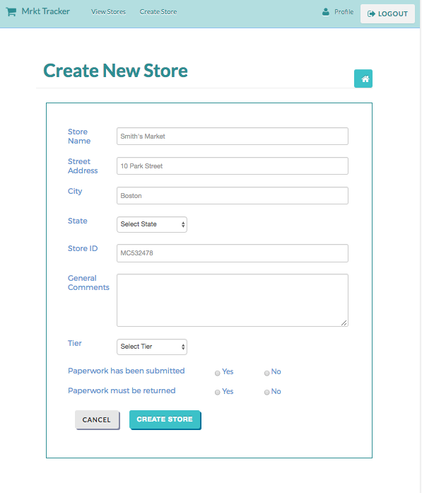

# MrktTracker #

Thinkful (https://www.thinkful.com) end of course portfolio project for server-side web development.

#### What is it? ####
MrktTracker was designed to help those in the sales and marketing industries create/maintain contact records for stores they visit. Records include address and location information, sales tier, and paperwork status.

#### Background ####
I built this app for a sales rep that was starting out, but had trouble managing the sheer volume of contacts, records, and paperwork. In an attempt to solve this problem, she purchased a set of hanging file folders with could fit in the trunk of her car. Problem solved, right? No. Things became dificult to find and tedious to organize. That is when I started building this app.

#### Use Case ####
Why is this app useful? A company's sales representatives are the main point of contact with an operator. However, representatives often have as many as 150+ stores and are left to tracking each store's data using antiquated paper filing. MrktTracker enables users to track and monitor their store's paperwork status and sales level, along with contact information for each operator.

#### Technical ####
This app was built HTML5, CSS3, jQuery, JavaScript, Node.js, MongoDB, and Mongoose. In order to maintain data between logins, this app has 2 APIs: a store API and a user API.

#### Functionality ####
 * New users create accounts with their email, location and company information
 * Users create new stores and provide data about it's location information, points of contact, sales level, paperwork preferences and status.
 
 * Users easily view a summarized listing of their stores
 
 * Users can view a detailed page of each store's information, with the option to edit or delete each one.
 
 * Users are able to edit any of the store's information for proper record keeping.
 

#### Development Roadmap ####
This is v1.0 of the app, but future updates and feature enhancements are expected to include:
 * Ability to add specific personnel to each store to enhance one-to-one communication
 * Maps to visually track location of stores
 * Maps to view attempted cold calls to improve productivity in the field

#### Contact information ####
Author: Larissa Morrell
Email: larissa.perkins@gmail.com
GitHub: https://github.com/LarissaMorrell
LinkedIn: https://www.linkedin.com/in/larissamorrell
